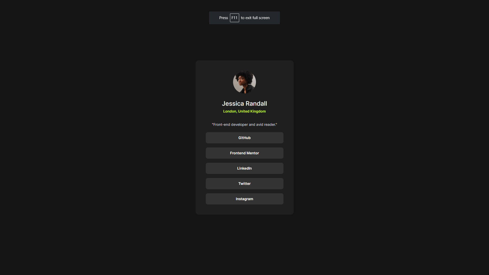

# Frontend Mentor - Social links profile solution

This is a solution to the [Social links profile challenge on Frontend Mentor](https://www.frontendmentor.io/challenges/social-links-profile-UG32l9m6dQ). Frontend Mentor challenges help you improve your coding skills by building realistic projects.

## Table of contents

- [Frontend Mentor - Social links profile solution](#frontend-mentor---social-links-profile-solution)
  - [Table of contents](#table-of-contents)
    - [Screenshot](#screenshot)
    - [Links](#links)
    - [Built with](#built-with)
  - [Author](#author)

### Screenshot

### Links

- Solution URL: [Solution Here](https://github.com/HarikrishnanYPR1707/social-link-profile)
- Live Site URL: [Live Site Here](https://social-link-profile-flame.vercel.app/)

### Built with

- Semantic HTML5 markup
- CSS custom properties
- Flexbox
- CSS Grid
- Mobile-first workflow
- [React](https://reactjs.org/) - JS library
- [Next.js](https://nextjs.org/) - React framework
- [Styled Components](https://styled-components.com/) - For styles

## Author

- Website - [Harikrishnan Prasannakumar](https://harikrishnanprasannakumar.vercel.app/)
- Frontend Mentor - [@HarikrishnanYPR1707](https://www.frontendmentor.io/profile/HarikrishnanYPR1707)
- Twitter - [@Harikrishn54947](https://twitter.com/Harikrishn54947)
